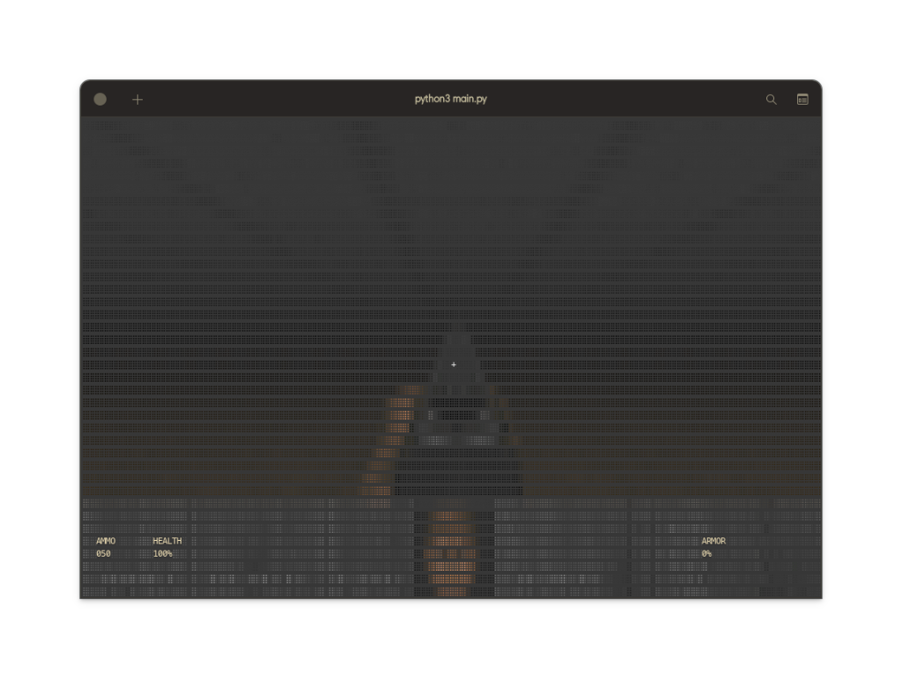

# DooM for AntigravitY

[](https://wsl.dev)
[](https://www.python.org/)
[](LICENSE)
[]()

> **The Engine is Alive.**
> 
> "It's not just ASCII. It's a high-resolution simulation rendered in the terminal."



## ⚡ Project Philosophy | 프로젝트 철학

**"Zero Dependencies, Infinite Possibilities."**

**DooM for AntigravitY** is a high-performance 3D game engine built largely from scratch using **only the Python Standard Library**. There is no `pygame`, no `numpy`, and no `ncurses`. Just pure math and string manipulation pushing the limits of the modern terminal.

**"의존성 제로, 무한한 가능성."**

**DooM for AntigravitY**는 `pygame`이나 `numpy` 같은 외부 라이브러리 없이, 오직 **파이썬 표준 라이브러리**만으로 구축된 고성능 3D 게임 엔진입니다. 순수 수학과 문자열 처리만으로 터미널의 한계에 도전합니다.

---

## 🛠️ Engine Architecture | 엔진 아키텍처

This project proves that the terminal is a valid graphics context if treated correctly.
이 프로젝트는 올바르게 다루어진다면 터미널도 훌륭한 그래픽 캔버스가 될 수 있음을 증명합니다.

### 1. High-Res Braille Rendering (312x152)
Instead of standard ASCII blocks (`#`, `@`), we utilize Unicode Braille Patterns (`⠀` to `⣿`) to achieve a resolution **8 times higher** than standard text.

- **Internal Buffer**: The engine renders to a `312x152` virtual pixel buffer (RGB).
- **Downsampling**: This buffer is mapped to the `156x38` terminal grid in `4x2` blocks.
- **Bitmasking**: Each 4x2 block creates specific Braille dot patterns (`0x2800 + mask`).
- **Visibility Guarantee**: Unlike standard braille converters, our engine separates **Structure** from **Color**. A dot exists if a wall exists, regardless of how dark it is. Walls never disappear.

### 2. Doom WAD Integration
We mistakenly don't use procedural generation. We parse **Original DOOM.WAD** files binary-first.

- **Direct WAD Parsing**: Reads `VERTEXES`, `LINEDEFS`, and `THINGS` lumps directly from the binary.
- **Flat Loading**: Parses raw 64x64 floor/ceiling texture lumps (`FLOOR7_1`, `CEIL3_5`).
- **Palette Mapping**: Converts Doom's indexed color palette to TrueColor ANSI escape codes.

### 3. Infinite FOV & Perspective
The output is mathematically corrected to handle the non-square aspect ratio of terminal characters (approx 1:2).

- **FOV**: Fixed at **90 Degrees** (1.57 rad) for the classic FPS feel.
- **Aspect Correction**: `WALL_SCALE` adjusted to 1.3 to prevent distortion.
- **Z-Shearing**: Look up/down implemented via Y-shearing (2.5D projection), not 3D rotation, keeping computations fast.

### 4. Input buffering
We solved the "terminal input lag" problem.

- **Buffered Input**: Instead of reading one key per frame, we drain the entire `stdin` buffer every cycle.
- **Debounced Movement**: This allows for smooth diagonal strafing and rapid-fire input without keys "ghosting" or getting stuck.

---

## 🕹️ Controls | 조작법

| Key | Action | 설명 |
| :--- | :--- | :--- |
| **W / S** | Move Forward / Backward | 전진 / 후진 |
| **A / D** | Strafe Left / Right | 좌우 평행 이동 |
| **Q / E** | Turn Left / Right | 시야 좌우 회전 (Cam) |
| **R / F** | Look Up / Down | 시야 상하 조절 (Pitch) |
| **Space** | Jump / Hover | 점프 / 호버링 |
| **1 / 2 / 3** | Physics Modes | 물리 모드 변경 (Normal / Zero-G / Inverted) |
| **X / Ctrl+C** | Quit | 게임 종료 |

---

## 🚀 How to Run | 실행 방법

```bash
# 1. Clone the repo
git clone https://github.com/dogsinatas29/doomforantigravity.git
cd doomforantigravity

# 2. Run the engine (Requires Python 3.8+)
python3 main.py
```

*Note: Ensure your terminal supports TrueColor and UTF-8 (e.g., Windows Terminal, iTerm2, Kitty).*

---

## 🎥 Development Log | 개발 일지

- **Sprint 1**: Infrastructure & ECS (Done)
- **Sprint 2**: WAD Parsing & map rasterization (Done)
- **Sprint 3**: "The Black Screen" Debugging (Solved via Block Rendering)
- **Sprint 4**: **Braille Resurrection** & High-Res Polish (Current State)

---

## 📄 License

**MIT License**
Copyright (c) 2026 Antigravity AI Team.
